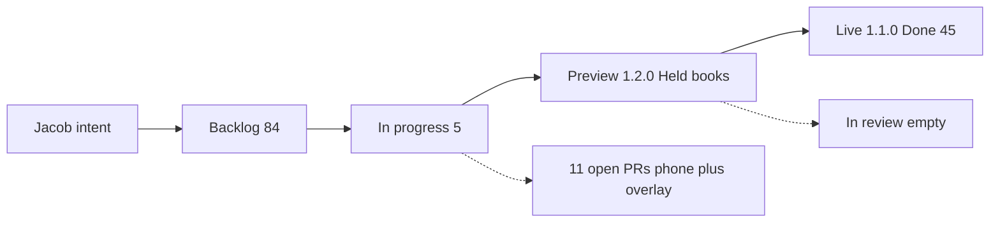

# Sprint report — 2026-08-25

Rehearsal day (Jacob fired 2:00 and 2:30 by hand). Overnight in # heliopoly build. Room is the live record.

## What landed (last 36h, extended for rehearsal)

| Plain English | Where it actually is | Notes |
| --- | --- | --- |
| AI team Ways of Working, personas, SpaceX, experiment log, Grok Build, ceremony times | `main` this morning | Process docs, not the game |
| Overlay restack (“costume over the desktop”) | Closed as a technique | White boot. Side handle stays dead. Do not restore. |
| Held books, Mark as the bank’s half, Dump in the dossier, rivals called The Ada | Preview 1.2.0 gold bar; still an open pull request | Not live. In review was empty. |
| Phone as a skinny browser: HTTP host, Launch on first screen, thumbs, Book, Refuel | Stack of unmerged pull requests | Collides on the shared stylesheet and main loop |
| Handbook Board Legend matching the canvas | Open pull request | Not on preview (preview pinned at 1.2.0) |
| Overlay HITL pull request | Still open | Must stay unmerged |

Live https://heliopoly.live/ is still 1.1.0. Lab is still visible there even though “hide Lab on production” is Done on the board.

## Wait line

- Sunday/web train on preview, not In review: Held books has been on preview while In review = 0. Jacob cannot see a HITL queue.
- Phone pile unmerged: layout stack through Refuel, all open, sitting on the same stylesheet. Architect: do not split the rest until a phone file exists that desktop never applies.

## Stream (VSM sketch)

Two trains. Phone must not ride Sunday’s tree.

The wait that matters today: preview is ahead of live, and In review is empty, so the human does not know what to test. Second wait: phone work is inventory in open PRs, not in In review, not on a physical iPhone.

## Retro (2)

1. When a change is actually on preview.heliopoly.live, the card moves to In review. Empty In review while preview is ahead is a process fail.
2. Human-testing flag must name the surface: `preview.heliopoly.live` or physical iPhone. Do not mix them on one ticket.

No new ceremony. Experiment 3 (modularization) still owns the shared-stylesheet collision. Docs PR for these two cuts was blocked (cloud agents not on this plan); room adopted them anyway.

## HITL for Jacob

| Work | Surface | Ready? |
| --- | --- | --- |
| Held books / Mark / Dump / The Ada | preview.heliopoly.live | Yes — this week’s web HITL |
| Phone kid path (Launch, thumbs, Refuel) | physical iPhone | No — one kid path does not exist yet; not preview |
| Overlay costume | none | Dead. Do not test. |

## Not this file

No backlog reorder. No new Grok Build chats for tickets that already have open PRs.
