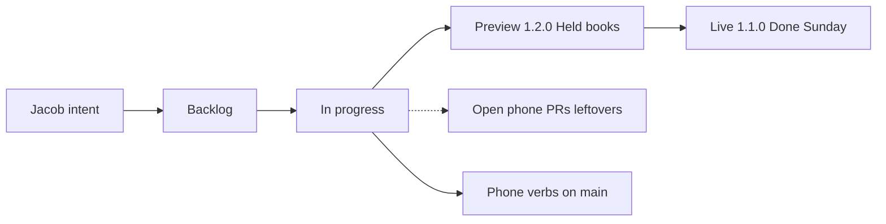

# Sprint report — 2026-08-27

Overnight in # heliopoly build. Room is the live record.

## What landed (last ~24h)

| Plain English | Where it actually is | Notes |
| --- | --- | --- |
| Phone Gravity Duel verbs on-screen (High / Low / Roll / Continue) | `main` (#179) | Playable on skinny web; not a Done card by itself |
| Phone auction Bid / Pass stay on-screen | `main` (#183) | Same |
| Phone end screen winner + Rematch / Play again on-screen | `main` (#178) | Several follow-up fixes same day |
| Phone Refuel / Fuel depot above the three thumbs | `main` (#172) | Open PR #173 may still list as leftover |
| Phone Pilots 2–6 chips and roster fuel tanks | `main` (#170) | Open PR #171 may still list as leftover |
| iOS loopback accept so phone load is not a long timeout | `main` (#176) | Open PR #177 may still list as leftover |
| Held books / Mark / Dump / The Ada | Preview 1.2.0; open PR #143 | Still not live |
| Drop gold prototype bar; Add to Home Screen; handbook legend; overlay HITL | Open PRs #186 #187 #152 #146 | Overlay stays unmerged |

Live https://heliopoly.live/ is still **1.1.0**. Preview is **1.2.0** (gold bar).

## Wait line

- Sunday/web train on preview, not live: Held books (~3 days on preview) — still waiting on Sunday promote to heliopoly.live.
- Phone pile unmerged: several open PRs remain after the same work already hit `main` (stylesheet / host train). Colliding leftovers inflate the wait line.

## Stream (VSM sketch)

Inventory = pile in the box. Wait = time in the box. Two trains; phone must not ride Sunday’s tree.

Preview is ahead of live. Phone verbs landed on `main` while leftover PRs still sit open — inventory looks bigger than the real wait.

## Retro (2)

1. When phone work is already on `main`, close or supersede the leftover open PR for that same issue so the wait line is not fake inventory.
2. Same Grok Build chat for HITL feedback on the same issue; new chat only for a new issue number.

No new ceremony. SpaceX: delete fake wait, then simplify the Build handoff.

## HITL for Jacob

| Work | Surface | Ready? |
| --- | --- | --- |
| Held books / Mark / Dump / The Ada | preview.heliopoly.live | Yes — web HITL / Sunday train |
| Phone kid path (thumbs, Book, roster, cash, gold-bar) | physical iPhone | Partial — playable pieces on main; gold-bar drop and full kid path still open |
| Overlay costume | none | Dead. Do not test. |

## Not this file

No backlog reorder. No Grok Build prompts dump (Presley owns Ready packaging at 3:30).
