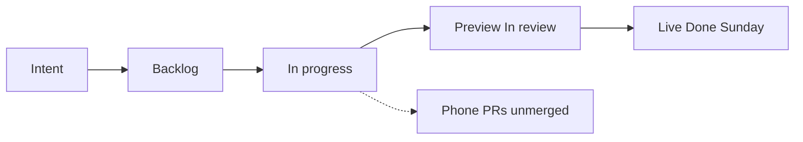

# Sprint report — YYYY-MM-DD

Overnight in # heliopoly build. Room is the live record.

## What landed (last ~24h, 36h if Jacob extends a rehearsal)

| Plain English | Where it actually is | Notes |
| --- | --- | --- |
| | live / preview / open PR / docs on main | |

Live = https://heliopoly.live/ only.

## Wait line

- Sunday/web train on preview, not In review: _N days — name the work_
- Phone pile unmerged: _N days — colliding on shared stylesheet? yes/no_

## Stream (VSM sketch)

Inventory = pile in the box. Wait = time in the box. Do not redraw boxes unless the path changed.

If a box is empty while work exists elsewhere, say so under the chart in one sentence.

## Retro (0–2)

1.
2.

Zero is allowed. Prefer delete / working agreement over new ceremony.

## HITL for Jacob

| Work | Surface | Ready? |
| --- | --- | --- |
| | preview.heliopoly.live or physical iPhone | yes/no |

## Not this file

No backlog reorder. No Grok Build prompts dump unless one issue is actually Ready and has no open PR.
